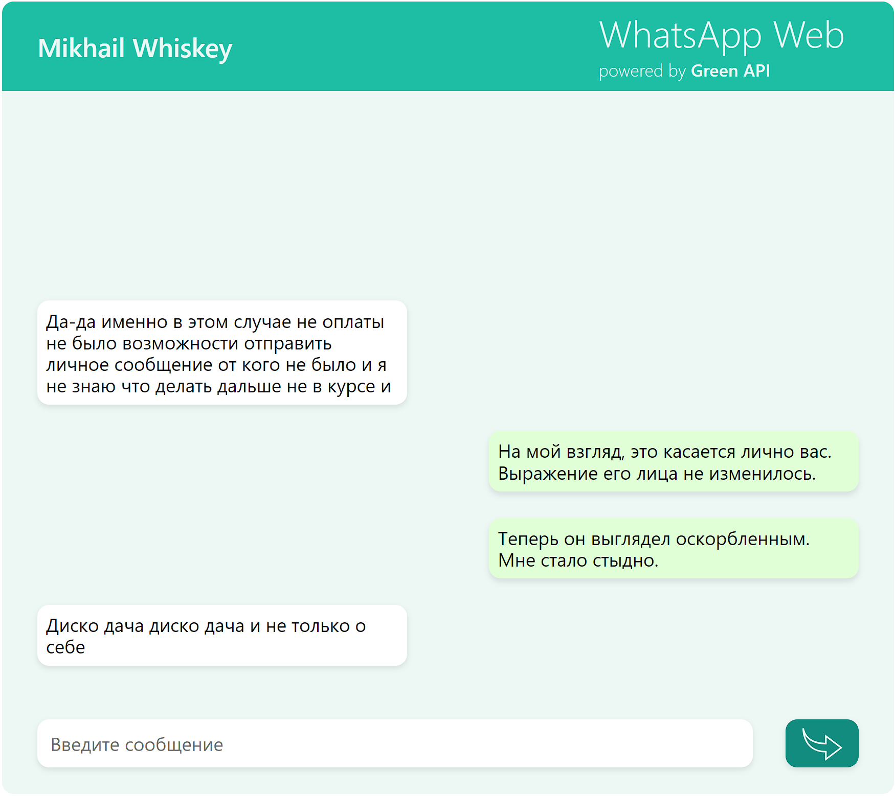
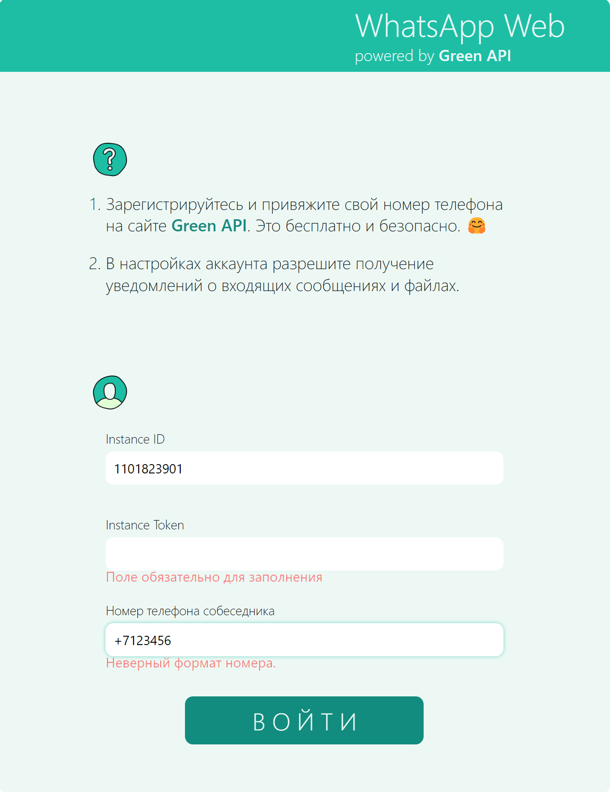

# Проект [WhatsApp Web App](https://wskymike.github.io/whatsapp-greenapi-react/) | Frontend

### 📜 Описание:
Одностраничное мини-приложение на `React.js` для обмена сообщениями из браузера с пользователями WhatsApp. Созданно с применением `Create React App` и имеет переиспользуемые компоненты. Подготовка к деплою - `WebPack` Респонсивная верстка с применением `Sass`. Применена методология БЭМ. Для статического анализа кода использовал `ESLint`. `PostCSS` добавляет вендорные пефиксы для кроссбраузерности.<br />
В планах добавить аватарки из профиля whatsapp в диалог и немного улучшить визуальную часть, сохранение диалога после перезагрузки страницы, вывод ошибок для улучшения взаимодействия приложения с пользователем.

### 📲 Как пользоватся:
* Зарегистрировавться на https://green-api.com/ для получения данных для авторизации (`idInstance` и `apiTokenInstance`) и привязки вашего номера WhatsApp.

* Авторизоваться в приложении. Чат откроется автоматически. Имя или номер телефона собеседника будет отображен в правом верхнем углу.

### ⚙️ Функционал:
* Single Page Application на Create React App в рамках одной страницы без перезагрузок.

* Отправку сообщений реализовал методом https://green-api.com/docs/api/sending/SendMessage/

* Получение сообщений реализовал методом https://green-api.com/docs/api/receiving/technology-http-api/

* Для формы авторизации использовал React Hook Form с валидацией.


### 🥞 Стек:

`HTML5` `CSS3` `JavaScript ES6+` `React v.18` `Create React App` `Webpack` `PostCSS` `ESLint` `Prettier` `БЭМ (Nested)` 

### 💽 Установка и запуск:

1. Склонировать репозиторий в текущую папку:

```git clone git@github.com:WskyMike/whatsapp-greenapi-react.git ./```

2. Установить зависимости:

```npm install```

3. Запустить проект в режиме разработки:

```npm run start```
<br />
<br />

<br />
<br />

<br />
<br />